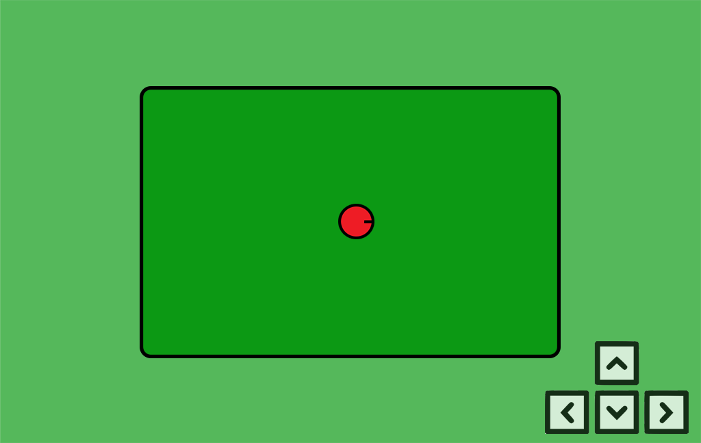
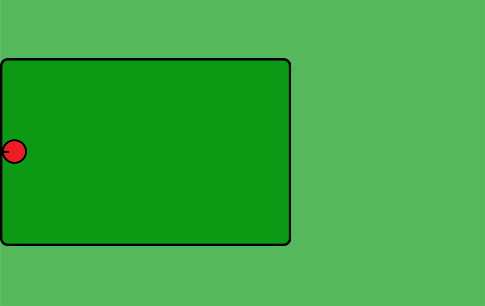
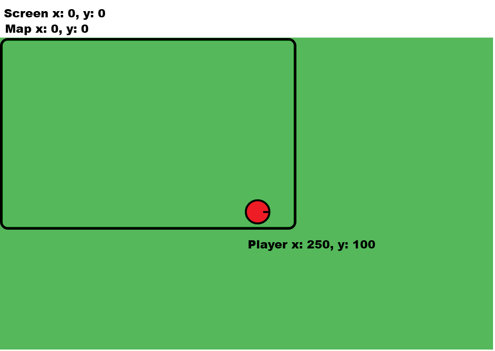
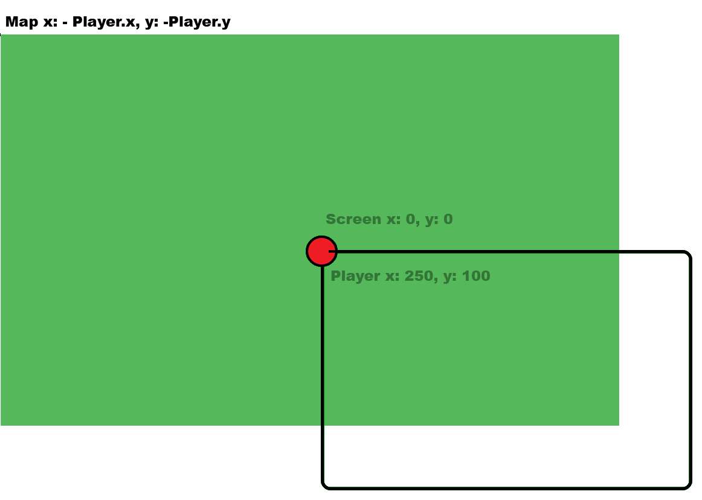
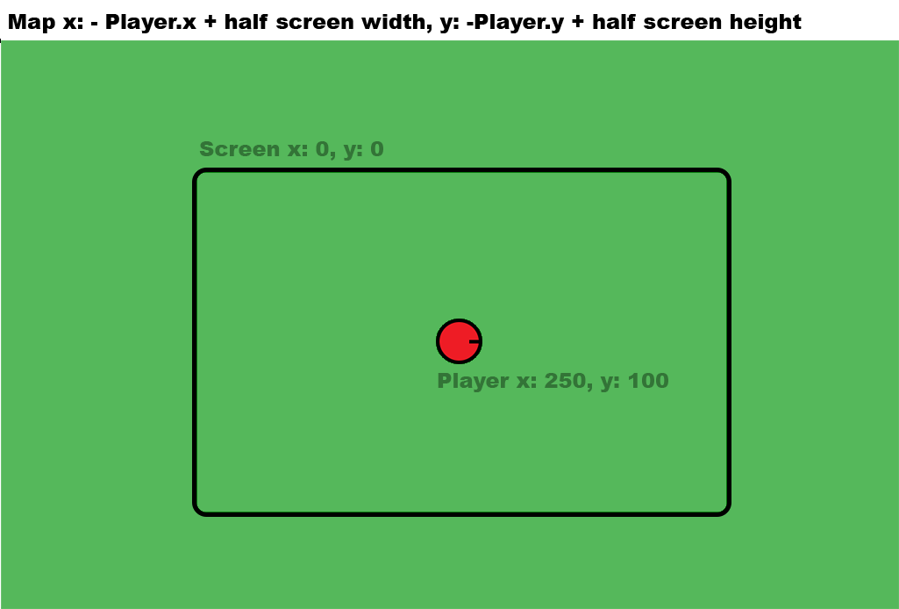

# PIXI, TypeScript: Character Movements + Screen Follow

We are going to create a keyboard controlled player plus a camera that follows the player (in reality its the map moving so the player remains in the center)  

## Topics

1.  [Keyboard Input](#keyboard_input)
2.  [Player Velocity](#player_velocity)
3.  [Player Boundaries](#player_boundaries)
4.  [Player Angle](#player_angle)
5.  [Main Game](#main_game)
6.  [Map Position](#player_position)

## Overview

- Seperate keyboard class to handle keyboard events.  
- Player has a X and Y velocity which gradually decreases if there are no movement keys pressed.  
- Player moves around map, limited to the map dimensions.  
- Map moves around stage to keep player in center of screen unless the player is approaching a boundary.  
  

## Keyboard Input

PixiJS has built in events to detect when any keyboard key is pressed or released:

    window.addEventListener("keydown", this.downHandler, false);
    window.addEventListener("keyup", this.upHandler, false);

We could create a new class to handle the keyboard events like this:  

    export class Keyboard{
    	constructor(){
    		this.addEventListeners()
    	}

    	public addEventListeners(){
    		window.addEventListener("keydown", this.downHandler.bind(this), false);
    		window.addEventListener("keyup", this.upHandler.bind(this), false);
    	}

    	public removeEventListeners(){
    		window.removeEventListener("keydown", this.downHandler);
    		window.removeEventListener("keyup", this.upHandler);
    	}

    	private downHandler(event:KeyboardEvent) {
    		if (event.key === "ArrowRight") {
    			//MOVE RIGHT
    		}
    		if (event.key === "ArrowDown") {
    			//MOVE DOWN
    		}
    		...
    	}

    	private upHandler(event:KeyboardEvent) {
    		if (event.key === "ArrowRight") {
    			//STOP MOVING RIGHT
    		}
    		if (event.key === "ArrowDown") {
    			//MOVE DOWN
    		}
    		...
    	}
    }

This would work but its not very practical because we would need to hard code an if(){} statement for each key ID: "ArrowUp","ArrowRight", etc.  

To get around this we can create an array of objects. Each object will contain the key ID and what functions should be called on press and release.  

In Typescript we can create an Interface (more info on Interfaces [here](https://www.typescriptlang.org/docs/handbook/interfaces.html)), we can use it to define which variables should be in our Key object. You create it similar to creating a class:  

    export interface Key{
    	keyID:string;
    	isDown:boolean;
    	isUp:boolean;
    	press:any; //function on press
    	release:any; //function on release
    } 

> In the source code this can be found in Utils/Keyboard.ts, above the Keyboard class.

Now back in the Keyboard class, we can create a Key array and a press and release function

    export class Keyboard{
    private keyList:Key[] = [];

    constructor(){
    	this.addEventListeners()
    }

    public addEventListeners(){
    	window.addEventListener("keydown", this.downHandler.bind(this), false);
    	window.addEventListener("keyup", this.upHandler.bind(this), false);
    }

    public removeEventListeners(){
    	window.removeEventListener("keydown", this.downHandler);
    	window.removeEventListener("keyup", this.upHandler);
    }

    public addKey(value:string, pressed:()=>{} = undefined, released:()=>{} = undefined ) {
    	let key:Key = {
    		keyID:keyID,
    		isDown:false,
    		isUp:true,
    		press:pressed,
    		release:released
    	};

    	this.keyList.push(key);

    	return key;
    }

    public removeKey(value:Key) {
    	const index: number = this.keyList.indexOf(value);
    	if (index !== -1) {
    		this.keyList.splice(index, 1);
    	}
    }

    private downHandler(event:KeyboardEvent) {
    	for(let i:number = 0; i < this.keyList.length; i++){
    		let key:Key = this.keyList[i];

    		if (event.key === key.keyID) {
    			if (key.isUp && key.press) key.press();
    			key.isDown = true;
    			key.isUp = false;
    			event.preventDefault();

    			break;
    		}
    	}
    }

    private upHandler(event:KeyboardEvent) {
    	for(let i:number = 0; i < this.keyList.length; i++){
    		let key:Key = this.keyList[i];

    		if (event.key === key.keyID) {
    			if (key.isDown && key.release) key.release();
    			key.isDown = false;
    			key.isUp = true;
    			event.preventDefault();
    			break;
    		}
    	}
    }

Now we can easily add a function to any key press we want like this:

    this.keyManager.addKey("ArrowRight", this.keyRightPressed.bind(this));
    	...

## Player Velocity

Create a new class called: PlayerMovementControl.ts  
The player will have two velocities X and Y, when a move key is pressed the velocity with change to the relevant direction.

    private velocityX:number = 0;
    private velocityY:number = 0;

    private speed:number = 5;

    constructor(private app:Application, private player:PIXI.Sprite, private mapRect:PIXI.Rectangle, keys:string[] = ["W","D","S","A"]){
    	this.createKeyboardEvents(keys);
    }

    private createKeyboardEvents(keys:string[]){
    	this.keyTop = this.keyManager.addKey(keys[0], this.keyTopPressed.bind(this));
    	this.keyRight = this.keyManager.addKey(keys[1], this.keyRightPressed.bind(this));
    	this.keyDown = this.keyManager.addKey(keys[2], this.keyDownPressed.bind(this));
    	this.keyLeft = this.keyManager.addKey(keys[3], this.keyLeftPressed.bind(this));
    }

    private keyTopPressed(){
    	this.velocityY = -this.speed;
    }

    private keyRightPressed(){
    	this.velocityX = this.speed;
    }

    private keyDownPressed(){
    	this.velocityY = this.speed;
    }

    private keyLeftPressed(){
    	this.velocityX = -this.speed;
    }

In most games you want the player to move as soon as the button is clicked but then have a gradual slow down on release. For this we can times the velocity by .95 when the key is no longer down, this will gradually reduce the characters speed.

    public gameLoop(){
    	if(this.velocityY != 0 && this.keyTop.isUp && this.keyDown.isUp){
    		this.velocityY *= this.drag;
    		if(Math.abs(this.velocityY) < .5){
    			this.velocityY = 0;
    		}
    	}

    	if(this.velocityX != 0 && this.keyRight.isUp && this.keyLeft.isUp){
    		this.velocityX *= this.drag;

    		if(Math.abs(this.velocityX) < .5){
    			this.velocityX = 0;
    		}
    	}
    }

We can then get the players new position by simply added the velocity to the current position.

## Player Boundaries

But before we update the players actual position we should check if he is within the map boundaries

    let newPlayerX:number = this.player.x + this.velocityX;
    let newPlayerY:number = this.player.y + this.velocityY;

    if(newPlayerX < 0){
    	newPlayerX = 0;
    }
    if(newPlayerX > this.mapRect.width){
    	newPlayerX = this.mapRect.width;
    }
    if(newPlayerY < 0){
    	newPlayerY = 0;
    }
    if(newPlayerY > this.mapRect.height){
    	newPlayerY = this.mapRect.height;
    }

    this.player.x = newPlayerX;
    this.player.y = newPlayerY;

## Player Angle

This is a fairly common line of code in game development and simple rotates the object based on a point relative to {x:0,y:0}

    this.player.rotation = Math.atan2(newPlayerY - this.player.y, newPlayerX - this.player.x);

> But watch out, this is the only place I know where a Maths function requires y before x

## Main Game

We can now create our main game class GameScreen.ts, we are simply adding a map sprite to the stage, a player sprite and creating an instance of our player controller class.

    private mapWidth:number;
    private mapHeight:number;

    private mapContainer:PIXI.Container;
    private playerContainer:PIXI.Container;

    private playerMoveController:PlayerMovementControl;

    private player:PIXI.Sprite;

    constructor(private app:Application){
    	this.mapWidth = app.screen.width * 2.5;
    	this.mapHeight = app.screen.height * 2.5;

    	this.mapContainer = this.createMap();
    	this.app.stage.addChild(this.mapContainer);

    	this.playerContainer = this.createPlayer();
    	this.app.stage.addChild(this.playerContainer);

    	this.playerMoveController = new PlayerMovementControl(this.app, this.player, new PIXI.Rectangle(0,0,this.mapWidth, this.mapHeight), ["ArrowUp","ArrowRight","ArrowDown","ArrowLeft"]);

    	app.ticker.add(delta => this.gameLoop(delta));
    }

    private createMap():PIXI.Container{
    	let mapContainer:PIXI.Container = new Container();

    	let mapBG:PIXI.Sprite = new PIXI.Sprite(Texture.from("field"));
    	mapBG.width = this.mapWidth;
    	mapBG.height = this.mapHeight;
    	mapContainer.addChild(mapBG);

    	//ADD MORE MAP ITEMS HERE

    	return mapContainer;
    }

    private createPlayer():PIXI.Container{
    	let playerContainer:PIXI.Container = new Container();

    	this.player = new PIXI.Sprite(Texture.from("player1"));
    	this.player.anchor.set(.5, .5);
    	this.player.x = this.app.screen.width * .45;
    	this.player.y = this.app.screen.height * .5;
    	playerContainer.addChild(this.player);

    	return playerContainer;
    }

    private gameLoop(delta:number){
    	//update the player movement 
    	this.playerMoveController.gameLoop(delta);
    }

## Map Position

We want the character to always be in the middle of the screen except at the edges of the map. To achieve this we can move the map opposite the players position.   And then plus half of the screen's width and height to place the player at the center of the screen. 

    let playerLocal:PIXI.Point = this.playerMoveController.getPlayerPosition();
    let screenCenter:PIXI.Point = new PIXI.Point(this.app.screen.width * .5, this.app.screen.height * .5);
    let newMapPos:PIXI.Point = new Point(-playerLocal.x + screenCenter.x, -playerLocal.y + screenCenter.y);

Similar to the player boundary code, we can limit the map movement so it stops moving when the map edge reaches the screen edge. This has the added benefit of the player continuing to move to the edge of the screen. 

    if(newMapPos.x < -this.mapWidth+this.app.screen.width){
    	newMapPos.x = -this.mapWidth+this.app.screen.width;
    }
    if(newMapPos.x > 0){
    	newMapPos.x = 0;
    }
    if(newMapPos.y < -this.mapHeight+this.app.screen.height){
    	newMapPos.y = -this.mapHeight+this.app.screen.height;
    }
    if(newMapPos.y > 0){
    	newMapPos.y = 0;
    }

    //and apply the calculated map positions to the map and player containers 
    this.mapContainer.x = newMapPos.x;
    this.mapContainer.y = newMapPos.y;
